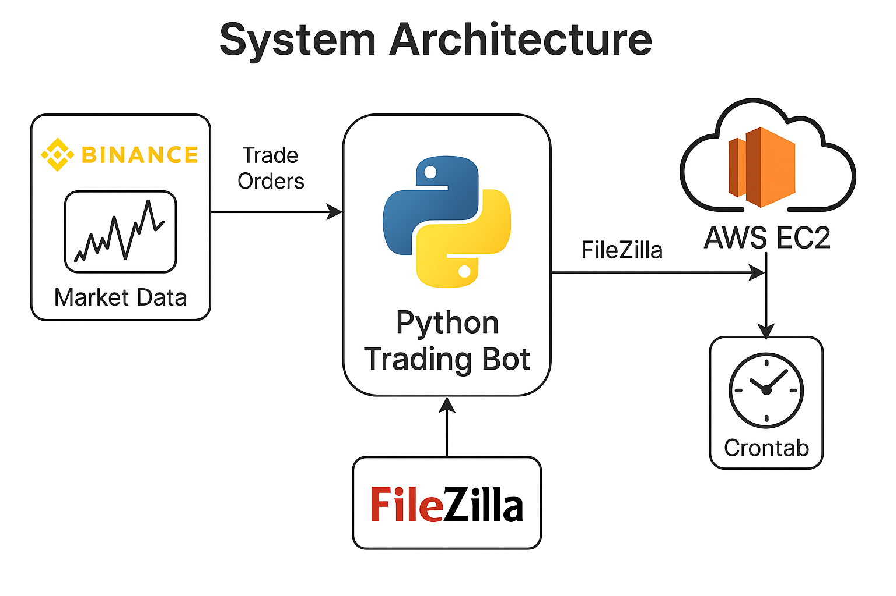

# Binance Futures Auto-Trading Bot


> 📈 A fully automated crypto trading bot for Binance Futures, designed to execute **directional trades** (long/short) on altcoins based on a trend-following strategy with volatility compression filters.  
> Developed with **Python**, deployed on **AWS EC2**, and scheduled via **crontab** to run hourly.

---

## 🔍 Project Overview

This bot identifies **uptrends** and **downtrends** among all Binance USDT Futures pairs by analyzing:
- Moving Averages (SMA 10, 20, 120)
- Bollinger Bands + BBW (Bollinger Band Width)
- Ichimoku Cloud (Span 1, Span 2)
- Candle body/volume characteristics
- Consecutive price action (e.g., 10 green/red candles)
- Fractal patterns (Williams 5-low)

Once trends are detected, the bot opens leveraged positions with take-profit conditions and closes them based on simple moving average reversal.  
All logic is implemented in **one Python file** and **executed hourly** on AWS.

---

## ⚙️ Key Features

✅ **Binance Futures integration** using `ccxt` and `python-binance`  
✅ **Uptrend/Downtrend detection** using multi-factor logic  
✅ **Volatility compression filter** for entry timing  
✅ **Fractal pattern-based trend validation**  
✅ **Dynamic capital allocation** based on position status  
✅ **Crontab-based automation (1-hour interval)**  
✅ **Real-time position management (TP, SL logic)**  
✅ **Concurrent multi-symbol scanning** using multithreading  
✅ **Logging and alerting system**

---

## 🧠 Strategy Logic (Trend Filtering)

### ✅ Uptrend Criteria
- Close above 70-bar high
- Bollinger Band breakout with rising upper band
- SMA10 > SMA20 and SMA20 > SMA120
- Green candles < 8
- Daily Bollinger condition met (not overextended)
- Williams fractal condition passed

### ⛔ Exclusion Conditions
- Candle body > 10x average
- Too many consecutive SMA rises
- Recent fractals consistently lower
- Price surge violates trend consistency

### 🛑 Position Exit
- Long: Close falls below SMA20 (1h)
- Short: Close rises above SMA20 (1h)

---

## 📁 File Structure

binance-futures-trading-bot/ ├── main.py # Full auto-trading logic ├── config_template.py # API key template (excluded via .gitignore) ├── requirements.txt # Required Python packages ├── crontab.txt # Crontab schedule example ├── docs/ │ └── architecture.png # System architecture diagram ├── log/ │ └── autotrading.log # Logging (excluded via .gitignore) └── README.md # You're reading this!


---

## 📌 System Architecture



1. **Hourly Execution** (via crontab on AWS)
2. Fetch OHLCV data from Binance Futures
3. Calculate indicators & trend filters
4. Multithreaded symbol scan
5. Detect strongest up/down coins
6. Manage open positions (enter/exit)
7. Log trade activity

---

## 🧪 Requirements

```bash
pip install -r requirements.txt

ccxt

pandas

numpy

python-binance

concurrent.futures (builtin)

🕒 Crontab (Linux, UTC)

30 * * * * /usr/bin/python3 /home/ubuntu/binance-futures-trading-bot/main.py >> /home/ubuntu/binance-futures-trading-bot/log/log.txt 2>&1


🔐 Security Note

Store your API key/secret in config_template.py (excluded via .gitignore)

NEVER upload real credentials to GitHub

💡 Future Plans

Add Discord/Telegram alerts for trades

Backtesting engine for strategy validation

More adaptive capital allocation

Risk management enhancements (e.g., ATR-based SL)

Web dashboard to monitor bot activity in real-time

👤 Author

Janghyuk Choi
Quantitative researcher & developer with a focus on automated systems, derivatives trading, and long-term macro strategy.

📫 [wkdgur7749@gmail.com]

📄 License
MIT License – Free to use, modify, and distribute with attribution
